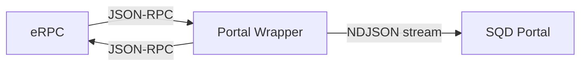
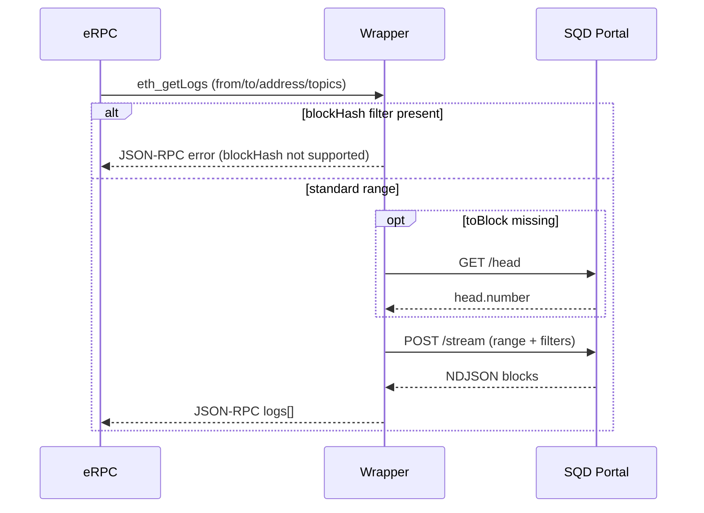
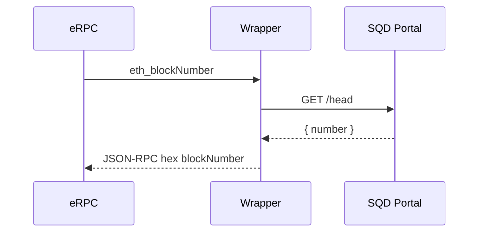
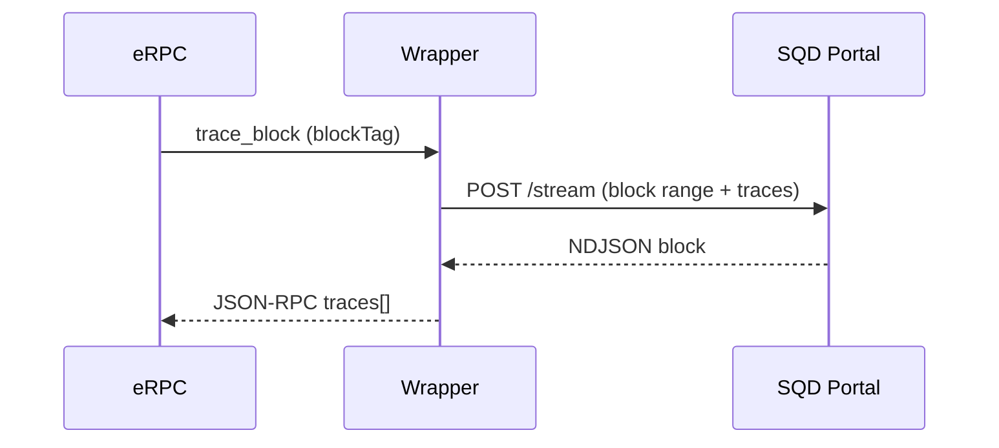
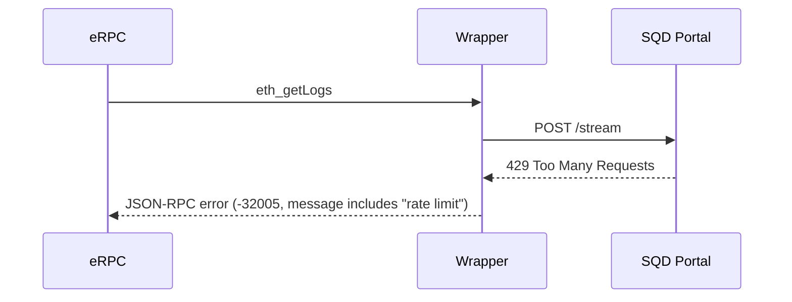
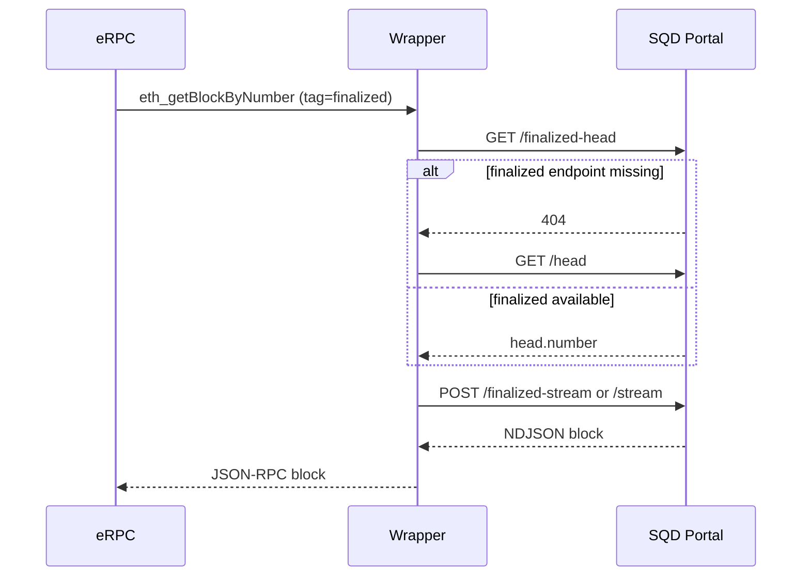

# Portal Wrapper External Service Spec

**Date:** 2026-01-23
**Status:** Draft

## Goal

Extract SQD Portal wrapper into standalone service. eRPC uses it as standard EVM JSON-RPC upstream.

## Non-goals

- No write/mempool/state methods.
- No websockets/subscriptions.
- No indexing/ETL or caching beyond request scope.

## Architecture



- Wrapper handles dataset routing, NDJSON parsing, request translation, JSON-RPC response shaping.
- eRPC treats wrapper as normal `type: evm` HTTP upstream.

## Design Alignment (eRPC SQD Portal Integration)

- Same method allowlist and historical-only scope.
- Same portal endpoints: `/head`, `/finalized-head`, `/stream`, `/finalized-stream`.
- Same chainId -> dataset mapping and override semantics.
- Same range/address/topic validation and limits.
- Same finalized fallback behavior.
- Same error intent and message keywords for eRPC normalization.
- Same field selection strategy (minimal fields unless full tx requested).

## Implementation Language

- TypeScript (Node.js).
- Use SQD Portal TypeScript SDK if available; fall back to raw HTTP for gaps.
- Prefer SDK for request types, auth, and endpoint helpers to minimize drift.

## API

### Transport

- HTTP/1.1 JSON-RPC 2.0
- `Content-Type: application/json`
- Gzip accepted
- Batch requests supported
- Auth: API key header (see Configuration)

### Endpoints

- `POST /` (single-chain mode)
- `POST /v1/evm/{chainId}` (multi-chain mode)
- `GET /healthz` (liveness)
- `GET /readyz` (readiness)
- `GET /metrics` (Prometheus)

### Auth header

- If `WRAPPER_API_KEY` set: require `X-API-Key: <key>` (or header name override).

### Chain selection

- Single-chain mode: `PORTAL_DATASET` or `PORTAL_DATASET_MAP` with fixed chainId.
- Multi-chain mode: `chainId` path param or `X-Chain-Id` header.

### Dataset resolution

- Default base: `https://portal.sqd.dev/datasets/{dataset}`.
- Resolve dataset by:
  1) `PORTAL_DATASET` (single-chain override),
  2) `PORTAL_DATASET_MAP[chainId]` (hardcoded defaults + config overrides),
  3) error if unknown chainId.
- Normalize base URL by trimming `/stream`, `/finalized-stream`, `/head`, `/finalized-head`.

Example mapping (keep aligned with `thirdparty/sqd_chain_mapping.go`):

| ChainId | Dataset |
|---:|---|
| 1 | ethereum-mainnet |
| 10 | optimism-mainnet |
| 56 | binance-mainnet |
| 100 | gnosis-mainnet |
| 137 | polygon-mainnet |
| 250 | fantom-mainnet |
| 324 | zksync-mainnet |
| 8453 | base-mainnet |
| 42161 | arbitrum-one |
| 42170 | arbitrum-nova |
| 43114 | avalanche-mainnet |
| 59144 | linea-mainnet |
| 534352 | scroll-mainnet |
| 81457 | blast-mainnet |
| 7777777 | zora-mainnet |
| 11155111 | ethereum-sepolia |
| 84532 | base-sepolia |
| 421614 | arbitrum-sepolia |
| 11155420 | optimism-sepolia |

## Supported JSON-RPC Methods

- `eth_chainId`
- `eth_blockNumber`
- `eth_getBlockByNumber`
- `eth_getTransactionByBlockNumberAndIndex`
- `eth_getLogs`
- `trace_block`

Unsupported -> JSON-RPC `-32601` + HTTP 404.

Optional upstream-only methods (when `UPSTREAM_METHODS_ENABLED=true` and upstream configured):
- `eth_getBlockByHash`
- `eth_getTransactionByHash`
- `eth_getTransactionReceipt`
- `trace_transaction`

## Translation Rules

### `eth_chainId`

- Return configured chainId. No portal call.

### `eth_blockNumber`

- `GET /head` (non-finalized). Return hex.

### `eth_getBlockByNumber`

- Parse block tag/hex/dec.
- `POST /stream` with `fromBlock=toBlock`.
- `fullTx` true -> full tx fields; false -> hash only.
- Empty -> `result: null`.
- `uncles` is empty unless upstream enrichment is enabled.

### `eth_getTransactionByBlockNumberAndIndex`

- Single block stream, scan tx by index.
- Missing -> `result: null`.

### `eth_getLogs`

- `blockHash` filter unsupported -> error (see Error Model).
- Use client-side error code + message to encourage eRPC fallback (mirrors eRPC ErrUpstreamRequestSkipped behavior).
- `toBlock` default: `/head`.
- `fromBlock` default: `toBlock`.
- Address/topics arrays; lowercase; map to Portal filters.
- Return flat log array.

### `trace_block`

- Single block stream with traces + tx hashes.
- Empty -> `result: []`.

## Sequence Flows

### `eth_getLogs`



### `eth_blockNumber`



### `trace_block`



### Error path (Portal 429)



### `eth_getBlockByNumber` (finalized fallback)



## Finality Rules

- `latest` or empty tag -> `/head` + `/stream`.
- `finalized`/`safe` -> `/finalized-head` + `/finalized-stream`.
  - If finalized endpoints 404: fallback to non-finalized; emit metric.
- `pending` -> client-side error (message includes "pending block not found").
- `earliest` -> block 0.

If `toBlock` not set and `fromBlock` uses finalized/safe, still use non-finalized stream to avoid empty head mismatch.

## Validation Rules

- Block number: hex/dec/int; range `0..(2^53-1)` (Number.MAX_SAFE_INTEGER).
- `eth_getLogs`:
  - `fromBlock <= toBlock`.
  - Max range 1,000,000 blocks; warn > 10,000.
  - Address: string or array; max 1,000; 20-byte hex.
  - Topics: array len <= 4; each item string or array; 32-byte hex.
- Transaction index: hex/dec/int; >= 0.

## Error Model

Wrapper returns JSON-RPC error object; HTTP status reflects severity. Messages must include substrings that trigger eRPC normalization.

### Mapping

| Condition | HTTP | JSON-RPC Code | Message contains (exact substring) | Notes |
|---|---:|---:|---|---|
| Invalid params | 400 | -32602 | `invalid` | input validation failures |
| Unsupported method | 404 | -32601 | `method not supported` | |
| Pending tag | 400 | -32602 | `pending block not found` | eRPC treats as unsupported tag |
| BlockHash filter | 400 | -32602 | `blockHash filter not supported` | allow fallback |
| Range too large | 400 | -32012 | `range too large` | include `max block range` |
| Too many addresses | 400 | -32012 | `specify less number of address` | eRPC -> addresses too large |
| Missing data | 404 | -32014 | `block not found` | or `requested data is not available` |
| Rate limit | 429 | -32005 | `Too Many Requests` | or `rate limit` |
| Unauthorized | 401/403 | -32016 | `unauthorized` | |
| Portal conflict | 409 | -32603 | `conflict` | include `data.retryable=true` |
| Portal unavailable | 503 | -32603 | `unavailable` | |

### Canonical error strings

Use these exact substrings (case-sensitive) to match eRPC normalization:

- Range too large: `range too large`, `max block range`
- Too many addresses: `specify less number of address`
- Rate limit: `Too Many Requests` or `rate limit`
- Pending tag: `pending block not found`
- Finalized/safe unsupported: `finalized block not found` or `safe block not found`
- Missing data: `block not found` or `requested data is not available`

### Portal status passthrough

- 200: success
- 204: empty result ([], null) based on method
- 400/401/403/404/409/429/503: map as above
- Other: 502 + `server error` message

## Configuration

### Required

- `SERVICE_LISTEN_ADDR` (default `:8080`)
- `SERVICE_MODE` = `single|multi`

### Portal

- `PORTAL_BASE_URL` (default `https://portal.sqd.dev/datasets`)
- `PORTAL_DATASET` (single-chain override)
- `PORTAL_DATASET_MAP` (chainId->dataset)
- `PORTAL_API_KEY` (optional)
- `PORTAL_API_KEY_HEADER` (default `X-API-Key`)

### Upstream (Optional)

- `UPSTREAM_RPC_URL` (optional)
- `UPSTREAM_RPC_URL_MAP` (chainId -> URL)
- `UPSTREAM_METHODS_ENABLED` (default `false`)

### Limits

- `MAX_LOG_BLOCK_RANGE` (default 1_000_000)
- `MAX_LOG_ADDRESSES` (default 1000)
- `MAX_BLOCK_NUMBER` (default 2^53-1)
- `HTTP_TIMEOUT` (default 60s)

### Auth (Incoming)

- `WRAPPER_API_KEY` (optional; if set, required on all requests)
- `WRAPPER_API_KEY_HEADER` (default `X-API-Key`)

## Security

- API key required when `WRAPPER_API_KEY` is set.
- No request body logging; redact headers.
- Stateless; no persistence.

## Observability

### Metrics

- `requests_total{method,chainId,status}`
- `portal_requests_total{endpoint,status}`
- `portal_latency_seconds{endpoint}`
- `ndjson_lines_total`
- `response_bytes_total`
- `errors_total{category}`
- `finalized_fallback_total`

### Logs

- request id, method, chainId, block range, portal status, duration

### Tracing

- W3C trace context; propagate `traceparent`

## Performance

- HTTP keep-alive to Portal.
- NDJSON streaming parse, bounded line size + max bytes.
- Concurrency limiter; 503 on overload.

## eRPC Integration

Example:

```yaml
projects:
  - id: main
    networks:
      - architecture: evm
        evm: { chainId: 1 }
        upstreams:
          - id: portal-wrapper
            type: evm
            endpoint: http://portal-wrapper:8080/v1/evm/1
            jsonRpc:
              headers:
                X-API-Key: ${PORTAL_WRAPPER_API_KEY}
            allowMethods:
              - eth_chainId
              - eth_blockNumber
              - eth_getBlockByNumber
              - eth_getTransactionByBlockNumberAndIndex
              - eth_getLogs
              - trace_block
            ignoreMethods: ["*"]
          - id: rpc-latest
            type: evm
            endpoint: https://rpc.example
```

## Migration Plan

1. Deploy wrapper; wire one project in eRPC.
2. Remove `SqdPortalClient` path; keep SQD vendor mapping only if still needed elsewhere.
3. Update docs/config templates.

## Testing

- Unit: validation, portal request shaping, NDJSON parsing, JSON-RPC conversion.
- Contract: compare wrapper output vs current portal client for same inputs.
- Integration: real Portal smoke tests.
- Regression: 429/409/503 mapping, pending tag, range too large, blockHash filter.

## Open Questions

- Single-chain vs multi-chain routing in prod?
- Use missing-data error vs empty result for portal lag?
- How strict should error messages be to maximize eRPC fallback?
