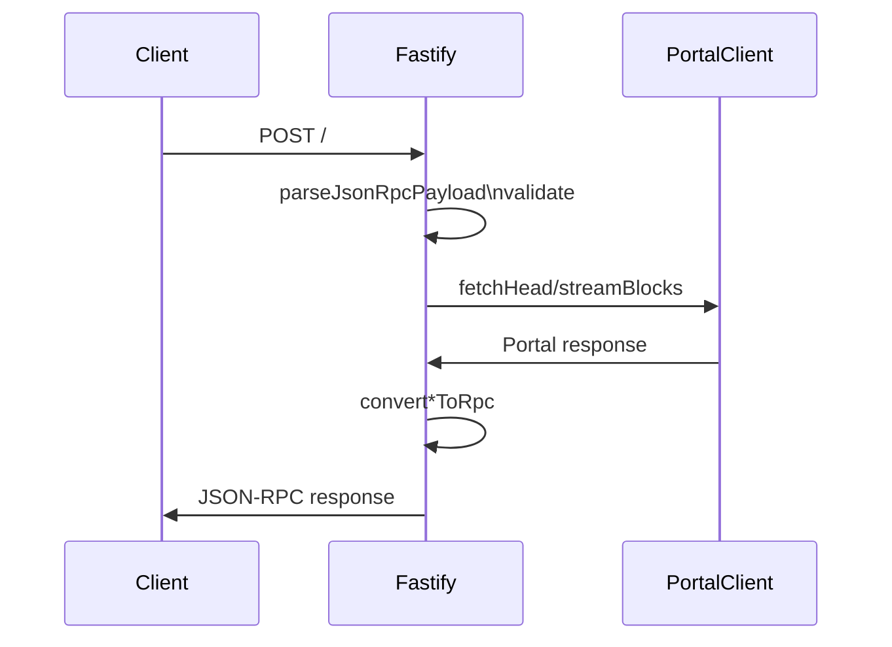

# Design Doc: sqd-portal-rpc-wrapper

Date: 2026-01-25
Status: Draft

## Scope
- EVM JSON-RPC wrapper over SQD Portal
- Supported methods only
- No realtime proxy endpoints

## Goals
- JSON-RPC compatibility for supported methods
- Deterministic conversions (Portal -> RPC)
- Safe limits: request size, NDJSON, log ranges
- Observability: metrics, structured logs

## Non-goals
- Full Ethereum node parity
- Pubsub / websocket
- Mempool / pending tx
- Caching / indexing

## Architecture (high-level)

```mermaid
flowchart LR
  client[Client JSON-RPC] --> server[Fastify server]
  server --> portal[PortalClient]
  portal --> sqd[SQD Portal]
  server --> upstream[Upstream RPC (optional)]
```

+------------------+       +-------------------+
| Client           |       | Upstream RPC (opt)|
| JSON-RPC         |       | fallback          |
+--------+---------+       +---------+---------+
         |                             ^
         | HTTP POST /                 |
         v                             |
+--------+---------+    stream/head    |
| Fastify server  +--------------------+
| routes + auth   |
+--------+---------+
         |
         | PortalClient (HTTP)
         v
+--------+---------+
| SQD Portal       |
| head/stream/meta |
+------------------+

## Components
- Fastify server: routes, auth, body limits, metrics
- JSON-RPC parser: validates request shapes, batch handling
- Handlers: method dispatch, input validation, portal queries
- Conversion: Portal types -> JSON-RPC shapes
- PortalClient: head/stream/meta, NDJSON parsing, gzip limits
- UpstreamRpcClient: optional proxy for unsupported params
- Metrics: Prometheus counters/gauges

## Request Flow: JSON-RPC



Client -> POST /
  -> parse JSON
  -> validate (jsonrpc/method/id/params)
  -> dispatch handler
  -> PortalClient fetch/stream
  -> convert response
  -> JSON-RPC response

ASCII flow:

[HTTP POST /]
    |
    v
[parseJsonRpcPayload]
    |
    v
[dispatchMethod]
    |
    +--> [validation]
    |
    +--> [PortalClient.fetchHead/streamBlocks]
    |
    +--> [convert*ToRpc]
    |
    v
[JSON-RPC response]

## Method-specific Flow

### eth_chainId
- No portal call
- Return hex chainId

### eth_blockNumber
- Portal head
- Return hex head.number

### eth_getBlockByNumber
- Validate params, reject non-boolean fullTx
- Parse block tag (latest/finalized/safe/earliest/number)
- start_block gate: return null if below start
- Stream single block, convert

### eth_getTransactionByBlockNumberAndIndex
- Parse block tag + tx index
- start_block gate: return null if below start
- Stream block w/ transactions, search index
- Return tx or null

### eth_getLogs
- Parse filter, enforce address/topic constraints
- Support blockHash filter: proxy upstream when configured
- start_block clamp, range limit
- Stream blocks -> logs -> convert

### trace_block
- Parse block tag
- Reject/Proxy pending + blockHash param
- start_block gate: empty array
- Stream block -> traces -> convert

## Error Handling
- JSON parse error => -32700
- Invalid request => -32600
- Invalid params => -32602
- Unsupported method => -32601
- Portal errors normalized to -32603 + HTTP mapping
- Upstream errors mapped to category/HTTP status

## Limits / Guardrails
- Request body size limit
- NDJSON max line bytes, total bytes
- Log filter: max addresses, block range
- Max concurrency limiter

## Observability
- Structured logs with requestId, method, chainId
- Metrics: request counts, durations, portal conflict, realtime gauge

## Data Mapping
- Block/tx/log/trace mapping in `src/rpc/conversion.ts`
- Optional EIP-4844 / withdrawals fields passed through when present
- Nonce normalization to 8-byte hex

## Failure Modes
- Portal unavailable -> server_error (502)
- Finalized head unavailable -> fallback to non-finalized when allowed
- Realtime required but not supported -> startup error (prefetch)

## Testing Strategy
- Unit: validation, conversion, errors
- Handler: per-method flows, boundary conditions, start_block
- Upstream client: error mapping, id handling
- Live compare (optional): portal vs base RPC
