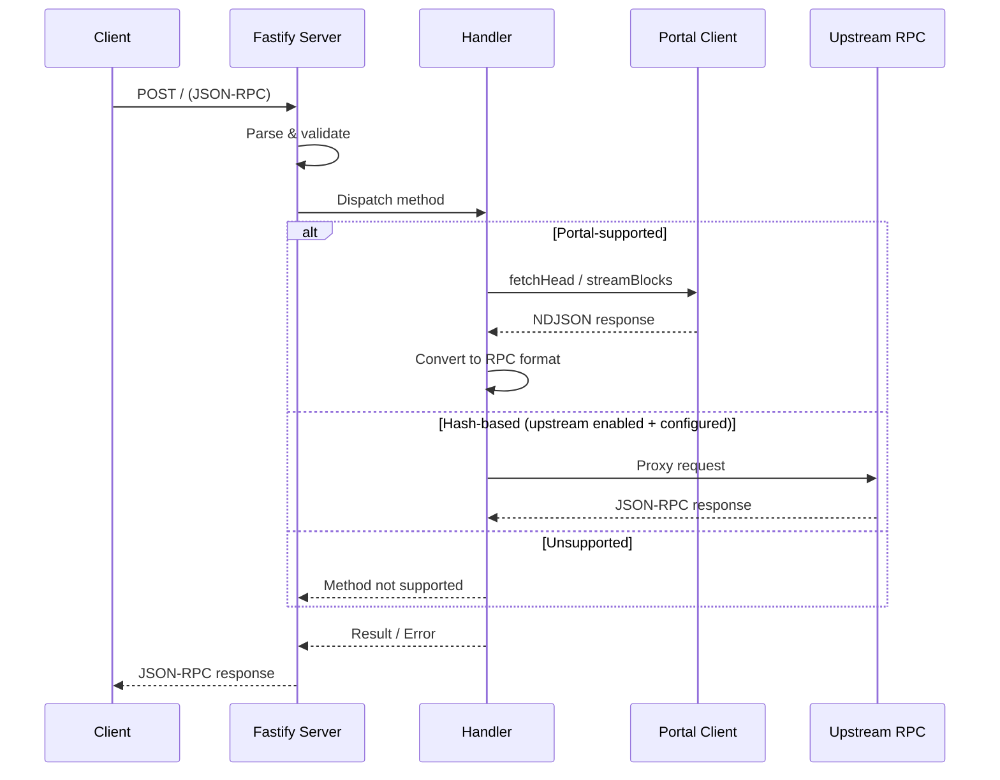

# Architecture

## Overview

The SQD Portal RPC Wrapper translates standard Ethereum JSON-RPC calls into optimized SQD Portal streaming queries.

```
┌─────────────┐     JSON-RPC      ┌──────────────────┐     NDJSON      ┌─────────────┐
│   Client    │ ◄───────────────► │  Portal Wrapper  │ ◄─────────────► │ SQD Portal  │
│             │                   │    (Fastify)     │                 │  (datasets) │
└─────────────┘                   └────────┬─────────┘                 └─────────────┘
                                           │
                                           │ Optional fallback
                                           ▼
                                  ┌──────────────────┐
                                  │   Upstream RPC   │
                                  │ (hash lookups)   │
                                  └──────────────────┘
```

## Components

### Fastify Server
- HTTP/1.1 with gzip support
- Request body size limits
- Concurrent request limiting
- API key authentication
- Structured JSON logging

### JSON-RPC Parser
- Validates JSON-RPC 2.0 request structure
- Handles batch requests
- Validates method parameters

### Handlers
- Method-specific request processing
- Block tag resolution (`latest`, `finalized`, `safe`, `earliest`, `pending`)
- Input validation and normalization

### Portal Client
- HTTP client for SQD Portal API
- NDJSON stream parsing
- Metadata caching with TTL
- Circuit breaker for fault tolerance
- Automatic finalized fallback

### Upstream RPC Client
- Optional fallback for hash-based methods
- Error normalization

### Conversion Layer
- Portal block/tx/log/trace → JSON-RPC format
- Hex quantity normalization
- Optional field handling (EIP-1559, EIP-4844, withdrawals)

## Request Flow



## Data Flow

### Block Query (`eth_getBlockByNumber`)

1. Parse block tag (number, `latest`, `finalized`, etc.)
2. If `finalized`/`safe`: try `/finalized-head`, fallback to `/head`
3. Check against `start_block` from metadata
4. Stream single block from Portal with selected fields
5. Convert Portal block to JSON-RPC format

### Log Query (`eth_getLogs`)

1. Parse filter (fromBlock, toBlock, address, topics)
2. Validate range limits
3. Resolve block tags to numbers
4. Stream blocks with log filters
5. Flatten and convert logs to JSON-RPC format

## Batch Coalescing

Batch requests for `eth_getBlockByNumber`, `eth_getTransactionByBlockNumberAndIndex`, and `trace_block`
are coalesced into fewer Portal streams.

- Group by finality (`head` vs `finalized`)
- Merge contiguous block numbers into segments
- Single Portal stream per segment
- Reuse full‑transaction stream for hash‑only block requests in the same segment
- Return `null`/`[]` when blocks are missing or below `start_block`

```
[b5][b6]   [b8]
   │         │
   ├─ segment (5..6) ──► Portal stream (full tx if needed)
   └─ segment (8..8) ──► Portal stream
```

## Finalized Block Handling

The wrapper supports Ethereum's finalized/safe block tags:

| Tag | Portal Endpoint | Fallback |
|-----|-----------------|----------|
| `latest` | `/head` + `/stream` | — |
| `finalized` | `/finalized-head` + `/finalized-stream` | `/head` + `/stream` |
| `safe` | `/finalized-head` + `/finalized-stream` | `/head` + `/stream` |
| `pending` | — | Error |
| `earliest` | Block 0 | — |

When finalized endpoints return 404, the wrapper automatically falls back to non-finalized endpoints and increments the `finalized_fallback_total` metric.

## Circuit Breaker

The Portal client includes an optional circuit breaker:

```
PORTAL_CIRCUIT_BREAKER_THRESHOLD=5   # Open after 5 failures
PORTAL_CIRCUIT_BREAKER_RESET_MS=30000  # Reset after 30s
```

When open, requests fail fast with 503 instead of waiting for Portal timeouts.

## Observability

### Metrics (Prometheus)

- `requests_total{method,chainId,status}` - JSON-RPC requests
- `rpc_duration_seconds{method}` - JSON-RPC handler duration
- `rpc_timeouts_total{method}` - JSON-RPC handler timeouts
- `batch_requests_total{count}` - Batch requests by size bucket
- `batch_items_total{status}` - Batch items processed
- `portal_requests_total{endpoint,status}` - Portal HTTP requests
- `portal_latency_seconds{endpoint}` - Portal latency histogram
- `upstream_requests_total{status}` - Upstream JSON-RPC requests
- `upstream_latency_seconds{endpoint}` - Upstream latency histogram
- `portal_unsupported_fields_total{field}` - Portal unsupported fields
- `rate_limit_total{source}` - Rate limit errors by source
- `ndjson_bytes_total` - NDJSON bytes parsed
- `errors_total{category}` - Errors by category
- `finalized_fallback_total` - Finalized endpoint fallbacks

### Logging

Structured JSON logs with:
- Request ID (`requestId`)
- Method name
- Chain ID
- Duration
- Portal response status
