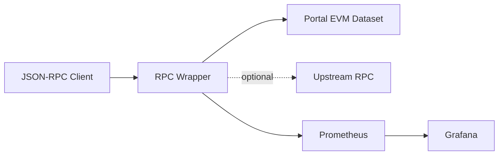
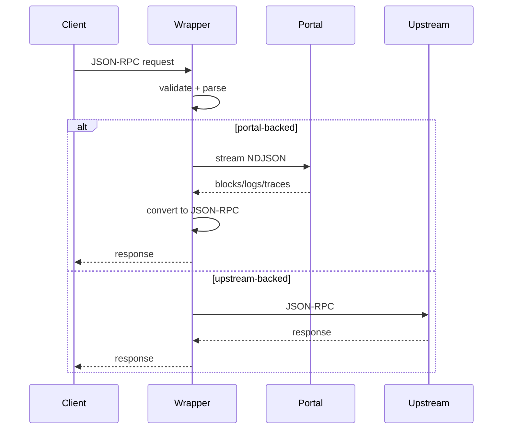
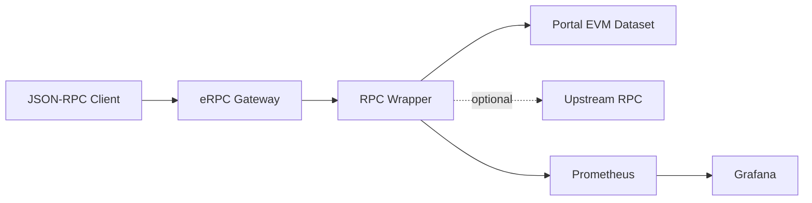

# Deep Dive: SQD Portal RPC Wrapper

This document is a technical deep dive into the SQD Portal RPC Wrapper. It is intended for engineers and operators who want to understand how the service works, what it supports, and how it behaves under load.

## Purpose

Portal exposes historical EVM data via NDJSON streams. Most clients expect JSON-RPC 2.0. The wrapper translates between those interfaces while enforcing validation, consistent error semantics, and predictable field mapping.

Scope:
- Provide JSON-RPC semantics for supported methods.
- Map Portal stream data into EVM RPC response shapes.
- Optional upstream integration for hash-based and pending queries.

Non-goals:
- State-dependent methods (eth_call, eth_getBalance, eth_getStorageAt, etc.).
- Full node parity outside the supported method set.

## Architecture Overview

Key points:
- Wrapper is the protocol boundary: validate, translate, and normalize responses.
- Upstream calls are optional and explicitly gated.

## Request Lifecycle

## Supported Methods and Routing

Portal-backed methods:
- eth_chainId
- eth_blockNumber
- eth_getBlockByNumber
- eth_getTransactionByBlockNumberAndIndex
- eth_getLogs
- trace_block

Optional upstream methods (only when enabled):
- eth_getBlockByHash
- eth_getTransactionByHash
- eth_getTransactionReceipt
- trace_transaction

Routing behavior:
- Upstream calls require `UPSTREAM_METHODS_ENABLED=true` and a configured URL.
- Pending or blockHash filters may proxy upstream when enabled.

## Data Mapping and Field Negotiation

- Portal blocks/logs/traces are mapped to JSON-RPC objects with required fields.
- Required fields are enforced; if Portal does not support a required field, the wrapper fails fast.
- Negotiable field handling:
  - `authorizationList` is treated as negotiable and may be removed from Portal requests.
  - Required fields are never stripped to avoid malformed JSON-RPC responses.

## Finality and Realtime

- Supports `latest`, `safe`, and `finalized` tags.
- When finalized head/stream is not available, wrapper falls back to non-finalized and records metrics.
- Realtime mode:
  - `disabled`: always non-realtime
  - `auto`: enabled when Portal advertises realtime
  - `required`: error when Portal does not advertise realtime

## Batch Handling and Caching

- Fully supports JSON-RPC batch requests.
- Per-request validation and response construction.
- Per-request caching:
  - Request dedupe cache (by params)
  - start_block cache for metadata access
- Batch size metric buckets for observability.

## Error Semantics

Portal HTTP status to JSON-RPC mapping:
- 400 -> -32602 invalid params
- 404 -> -32014 not found
- 409 -> conflict with previousBlocks payload
- 429 -> rate limit
- 503 -> unavailable

Wrapper validation errors:
- parse error -> -32700
- invalid request -> -32600
- method not supported -> -32601

## Performance Summary

Benchmark results are published in `docs/benchmarks/report.md`.

Highlights (Base mainnet, 10 iterations):
- Wrapper dominates at large batch sizes due to NDJSON stream amortization.
- Single-call latency for block/tx methods is higher than direct RPC, expected due to stream conversion.

See `/benchmarks/` for charts and raw data.

## Performance Charts

These charts reuse the same JS chart components as the benchmarks page.

### Mean Latency by Method

<LatencyChart
  title="Mean Latency by Method"
  :labels='["eth_blockNumber", "eth_getBlockByHash", "eth_getBlockByNumber (no tx)", "eth_getBlockByNumber (full tx)", "eth_getLogs", "eth_getTransactionByBlockNumberAndIndex", "eth_getTransactionByHash", "eth_getTransactionReceipt", "trace_block", "trace_transaction"]'
  :wrapper-data="[37.24, 46.51, 95.58, 97.73, 51.79, 92.67, 42.39, 45.06, 239.98, 43.03]"
  :rpc-data="[50.59, 43.79, 44.08, 59.2, 40.25, 42.74, 40.84, 42.3, 196.4, 39.3]"
  y-axis-label="Mean Latency (ms)"
/>

### P95 Latency by Method

<LatencyChart
  title="P95 Latency by Method"
  :labels='["eth_blockNumber", "eth_getBlockByHash", "eth_getBlockByNumber (no tx)", "eth_getBlockByNumber (full tx)", "eth_getLogs", "eth_getTransactionByBlockNumberAndIndex", "eth_getTransactionByHash", "eth_getTransactionReceipt", "trace_block", "trace_transaction"]'
  :wrapper-data="[39.3, 62.81, 216.27, 146.16, 55.9, 147.85, 44.69, 49.22, 322.43, 52.55]"
  :rpc-data="[64.21, 57.25, 48.48, 115.44, 44.15, 50.66, 54.94, 51.78, 245.01, 46.75]"
  y-axis-label="P95 Latency (ms)"
/>

### Relative Performance (Speedup)

<SpeedupChart
  :labels='["eth_blockNumber", "eth_getBlockByHash", "eth_getBlockByNumber (no tx)", "eth_getBlockByNumber (full tx)", "eth_getLogs", "eth_getTransactionByBlockNumberAndIndex", "eth_getTransactionByHash", "eth_getTransactionReceipt", "trace_block", "trace_transaction"]'
  :speedups="[1.36, 0.94, 0.46, 0.61, 0.78, 0.46, 0.96, 0.94, 0.82, 0.91]"
/>

### Batch Scaling

<BatchChart
  title="eth_blockNumber: Batch Size vs Latency"
  :batch-sizes="[1, 5, 10, 25, 1000, 10000]"
  :wrapper-data="[41.64, 38.32, 37.66, 36.75, 39.69, 56.28]"
  :rpc-data="[41.44, 45.51, 48.6, 53.51, 229.68, 2324.54]"
/>

<BatchChart
  title="eth_getBlockByNumber: Batch Size vs Latency"
  :batch-sizes="[1, 5, 10, 25, 1000, 10000]"
  :wrapper-data="[91.64, 83.82, 80.51, 90.55, 139.79, 438.53]"
  :rpc-data="[43.35, 47.94, 54.4, 65.85, 276.57, 3402.79]"
/>

<BatchChart
  title="eth_getLogs: Batch Size vs Latency"
  :batch-sizes="[1, 5, 10, 25, 100, 100000]"
  :wrapper-data="[55.87, 48.79, 46.98, 49.94, 57.66, 4083.11]"
  :rpc-data="[41.15, 44.27, 55.51, 73.27, 79.2, 24428.35]"
/>

## Observability

Prometheus metrics:
- rpc_duration_seconds
- batch_requests_total
- portal_latency_seconds
- portal_requests_total
- portal_unsupported_fields_total
- rpc_timeouts_total

Grafana dashboard:
- `docs/public/grafana/sqd-portal-wrapper.json`

## Reliability Controls

- Request size limits
- NDJSON max bytes and max line bytes
- Portal circuit breaker (threshold + reset)
- Handler timeouts
- Concurrency limiter

## Optional eRPC Integration

Wrapper can be used as a provider behind an eRPC gateway. This is optional.

Notes:
- eRPC can manage provider routing and retries.
- Wrapper still enforces strict validation and error mapping.

## Deployment Checklist

- Set `SERVICE_MODE` and dataset config (`PORTAL_DATASET` or `PORTAL_DATASET_MAP`).
- If multi-tenant or strict environments, set `PORTAL_USE_DEFAULT_DATASETS=false`.
- Configure optional upstream and enable methods as needed.
- Monitor Prometheus + Grafana dashboard.

## Testing and Coverage

- Unit and integration tests cover all modules.
- Coverage currently 100% statements, branches, functions, and lines.
- Live compare tests available (skipped in CI) for parity checks.

## Future Work / Open Questions

- Additional required fields as Portal evolves (e.g., new EIPs).
- Formalized limits for large topic arrays.
- Enhanced batching strategies for heavy trace workloads.
