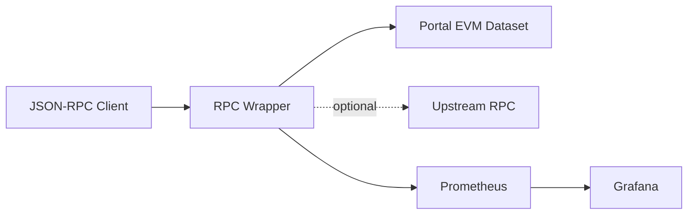
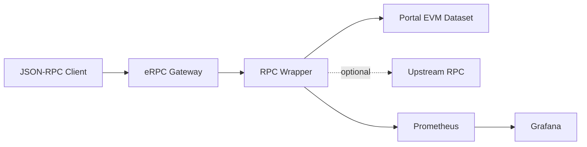
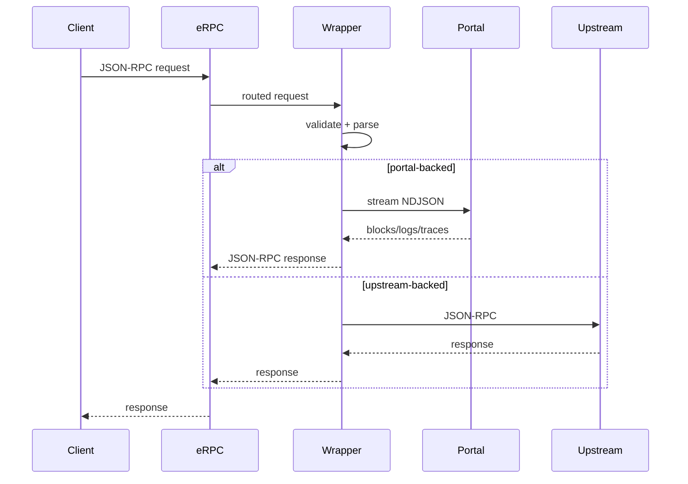
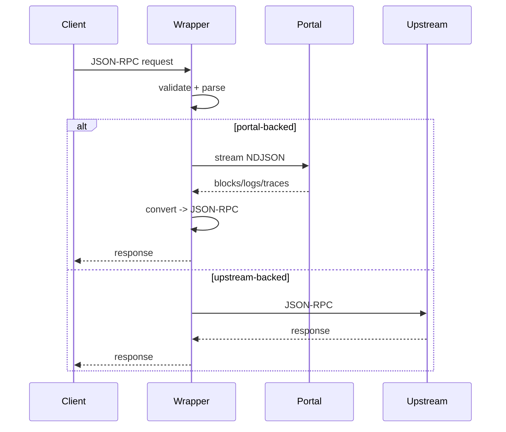

# Portal Team Deep Dive: SQD Portal RPC Wrapper

Date: 2026-01-26
Presenter: <your name>
Repo: sqd-portal-rpc-wrapper

Notes:
- Goal: deep technical walkthrough + decisions + tradeoffs
- Audience: Portal team (backend + platform)

---

# Agenda

- Problem + goals
- Architecture + request flow
- Optional eRPC integration
- Method coverage + data semantics
- Error mapping + edge cases
- Performance + batch behavior
- Observability + ops
- Tests + coverage
- Open questions / next steps

Notes:
- Keep to 30-40 minutes, leave Q/A at end

---

# Problem Statement

- Portal API = NDJSON stream, EVM dataset model
- Clients expect JSON-RPC 2.0 (EVM node semantics)
- Need stable, documented, testable adapter
- Optional upstream for hash/pending/receipt paths

Notes:
- Wrapper targets historical data, not stateful calls
- Upstream optional, config-gated

---

# Goals / Non-goals

Goals:
- JSON-RPC semantics for supported methods
- Strict validation + consistent errors
- Deterministic conversions + field mapping
- Observability + batch performance

Non-goals:
- State-dependent methods (eth_call, eth_getBalance, etc.)
- Full node parity for unsupported methods

Notes:
- This keeps scope aligned with Portal datasets

---

# High-Level Architecture

Notes:
- Wrapper owns validation + conversion
- Upstream only for methods explicitly enabled

---

# Optional eRPC Integration (Provider Mode)

Notes:
- eRPC is an optional provider; wrapper remains standalone
- Use eRPC for routing, retries, and provider pooling if desired

---

# eRPC Integration Flow (Optional)

Notes:
- eRPC can handle global retries + fallbacks
- Wrapper still enforces method validation + error mapping

---

# Request Flow (Single Call)

Notes:
- Validation and conversion are deterministic

---

# Dataset Resolution

- Single mode: explicit chain + dataset
- Multi mode: dataset map
- New flag: `PORTAL_USE_DEFAULT_DATASETS` (default true)
  - When false, only explicit maps allowed

Notes:
- Prevent accidental default chains in strict deployments

---

# Supported Methods (Portal)

Base methods:
- eth_chainId
- eth_blockNumber
- eth_getBlockByNumber
- eth_getTransactionByBlockNumberAndIndex
- eth_getLogs
- trace_block

Optional upstream methods:
- eth_getBlockByHash
- eth_getTransactionByHash
- eth_getTransactionReceipt
- trace_transaction

Notes:
- Optional methods are gated by `UPSTREAM_METHODS_ENABLED`

---

# Conversion & Field Mapping

- Portal blocks/logs/traces -> JSON-RPC objects
- Required fields enforced
- Unsupported Portal field negotiation
  - Negotiable: `authorizationList`
  - Required fields: hard error

Notes:
- Prevent silent partial responses

---

# Finality Handling

- `latest`, `safe`, `finalized` tags supported
- `safe/finalized` fallback to non-finalized when needed
- Metadata determines realtime support
- `PORTAL_REALTIME_MODE`: disabled | auto | required

Notes:
- Required mode fails on missing realtime metadata

---

# Batch Behavior

- Supports JSON-RPC batch requests
- Per-request validation + response
- Internal caching:
  - request dedupe by params
  - per-request start_block cache
- Batch size metrics via buckets

Notes:
- Large batches chunked in benchmark scripts

---

# Error Mapping

Portal HTTP -> JSON-RPC:
- 400 -> -32602 invalid params
- 404 -> -32014 not found
- 409 -> conflict w/ previousBlocks
- 429 -> rate_limit
- 503 -> unavailable

Wrapper validation:
- parse errors -> -32700
- invalid request -> -32600
- method not supported -> -32601

Notes:
- Consistent error strings; no external system coupling

---

# Performance Summary (Base Mainnet)

From docs/benchmarks/report.md (2026-01-25):

- Single-request mean latency (wrapper vs RPC)
  - eth_blockNumber: 37.24 vs 50.59 ms
  - eth_getLogs: 51.79 vs 40.25 ms
  - trace_block: 239.98 vs 196.40 ms

- Batch scaling: wrapper faster at large batches
  - eth_blockNumber batch=10000: 56.28 ms vs 2324.54 ms
  - eth_getLogs batch=100000: 4083 ms vs 24428 ms

Notes:
- Wrapper overhead visible for block/tx lookups
- Batch amortization wins big for Portal

---

# Benchmark Charts

```mermaid
xychart-beta
  title "Mean latency by method"
  x-axis ["eth_blockNumber", "eth_getBlockByHash", "eth_getBlockByNumber(fullTx=false)", "eth_getBlockByNumber(fullTx=true)", "eth_getLogs", "eth_getTransactionByBlockNumberAndIndex", "eth_getTransactionByHash", "eth_getTransactionReceipt", "trace_block", "trace_transaction"]
  y-axis "ms"
  bar "wrapper" [37.24, 46.51, 95.58, 97.73, 51.79, 92.67, 42.39, 45.06, 239.98, 43.03]
  bar "rpc" [50.59, 43.79, 44.08, 59.2, 40.25, 42.74, 40.84, 42.3, 196.4, 39.3]
```

Notes:
- Direct from benchmark report

---

# Batch Scaling: eth_blockNumber

```mermaid
xychart-beta
  title "Batch size vs mean latency (eth_blockNumber)"
  x-axis [1, 5, 10, 25, 1000, 10000]
  y-axis "ms"
  bar "wrapper" [41.64, 38.32, 37.66, 36.75, 39.69, 56.28]
  bar "rpc" [41.44, 45.51, 48.6, 53.51, 229.68, 2324.54]
```

Notes:
- Wrapper holds latency flat vs RPC

---

# Batch Scaling: eth_getLogs

```mermaid
xychart-beta
  title "Batch size vs mean latency (eth_getLogs)"
  x-axis [1, 5, 10, 25, 100, 100000]
  y-axis "ms"
  bar "wrapper" [55.87, 48.79, 46.98, 49.94, 57.66, 4083.11]
  bar "rpc" [41.15, 44.27, 55.51, 73.27, 79.2, 24428.35]
```

Notes:
- Portal stream handles huge batches better

---

# Observability

Prometheus metrics:
- rpc_duration_seconds
- batch_requests_total (bucketed)
- portal_latency_seconds
- portal_requests_total
- portal_unsupported_fields_total
- rpc_timeouts_total

Grafana dashboard:
- docs/public/grafana/sqd-portal-wrapper.json

Notes:
- Ready for import, no changes needed in Grafana

---

# Reliability Controls

- Request size limits
- NDJSON max bytes + line bytes
- Portal circuit breaker (threshold + reset)
- Handler timeouts
- Concurrency limiter

Notes:
- Defaults in config docs

---

# Tests & Coverage

- 100% statements/branches/functions/lines
- Unit + integration coverage
- Live compare tests (skipped in CI)

Notes:
- Coverage collected via `npm test`

---

# Ops Checklist

- Set PORTAL_BASE_URL + dataset map
- Decide `PORTAL_USE_DEFAULT_DATASETS`
- Configure upstream + enable methods if needed
- Monitor metrics dashboard

Notes:
- Keep upstream optional to avoid accidental calls

---

# Open Questions for Portal Team

- Any additional required fields to enforce?
- Preferred dataset defaults for multi-tenant deployments?
- Portal behavior for large log filters (limits)?
- Realtime semantics changes planned?

Notes:
- Drive roadmap alignment

---

# Appendix: Config Highlights

- `SERVICE_MODE=single|multi`
- `PORTAL_DATASET(_MAP)`
- `PORTAL_REALTIME_MODE=disabled|auto|required`
- `UPSTREAM_METHODS_ENABLED=true|false`
- `PORTAL_USE_DEFAULT_DATASETS=true|false`

Notes:
- See docs/config/* for full details

---

# Thank You

Questions
